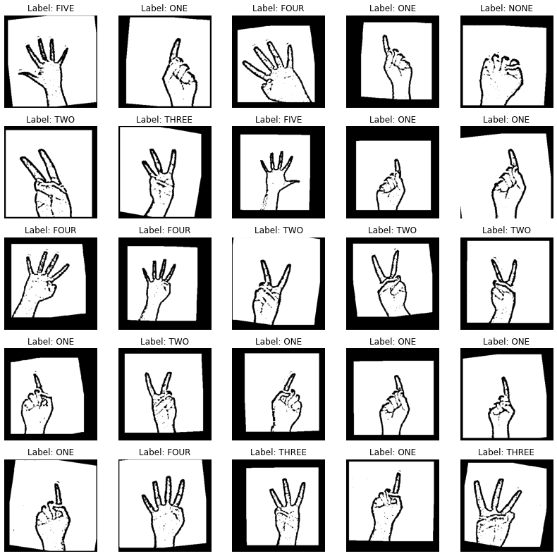
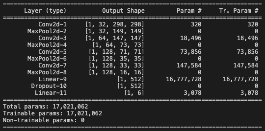
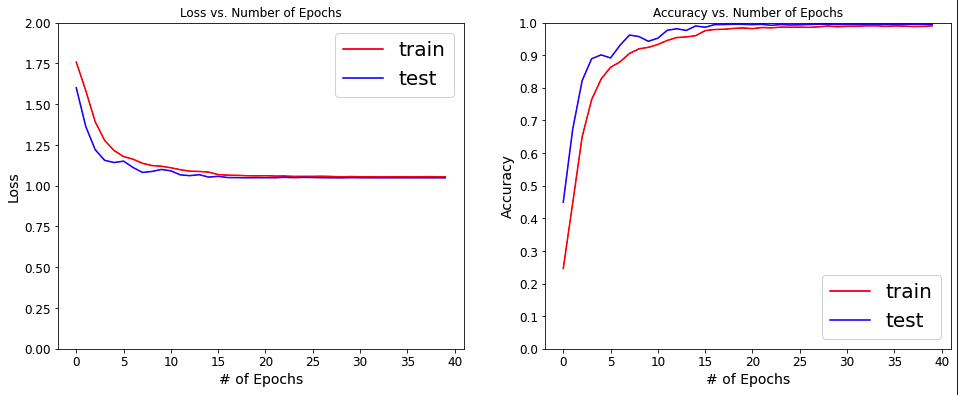
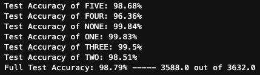
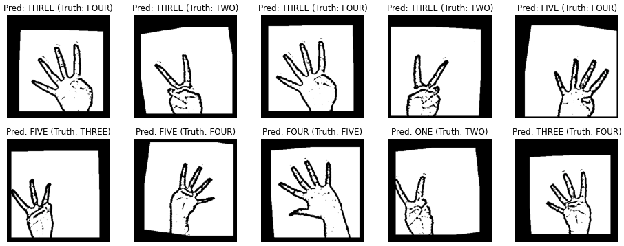
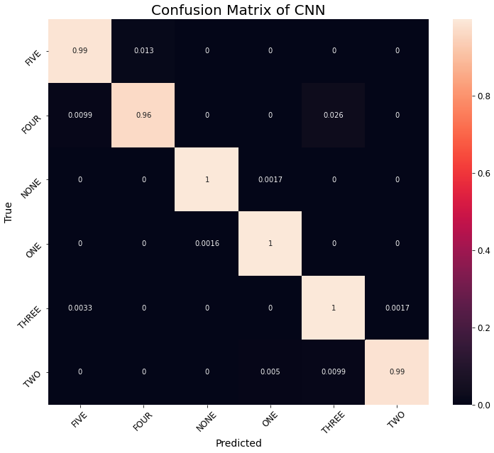

# CNN-HowManyFingers-PyTorch
A convolutional neural network (CNN) trained and implemented in PyTorch to predict the number of fingers being help up.

## Key Contents
* **app.py** - application to used to collect data and predict number of fingers 
* **train_model.ipynb** - jupyter notebook used for training model
* **images.tgz** - compressed tarball of complete training and validation/testing data
* **models/model_Final.pth** - final trained pretrained model
* **process_and_optimization** - see draft training notebook with notes for each step,model optimization notes (training iterations and hyperparameters changes), and more.

## Demo
Demo of digit counting with and without binary mask visible. 


# Application
An application within this repository uses the CNN and openCV to the make predictions real time of the number of fingers being help up.

## Usage
Run `app.py` and hold your hand up within the highlighted (red box) prediction region / region of interest (ROI).
The model performs best when provided a plain white background without many features.

### Keyboard Shortcuts
* The prediction region on the screen can be moved in different directions by pressing: 
      `i` key (up)
      `l` key (down)
      `j` key (left)
      `k` key (right)
* Display the binary mask being applied to the prediction region by toggling with the:
      `b` key
* Quit the application by pressing:
      `q` key

# Feature Input
Grayscaled images were used for training to simplify the number of inputs and computations used by the CNN. These were originally collected by applying a binary mask to highlight the hands edges and then applying thresholding.

The data was originally collected by holding up 0 to 5 fingers in the region of interest and storing the images. 
The original dataset from the baseline project was used, for which each label contains about 1500 images plus an additional 600 images for validation.
Please see baseline repo to learn more about this.



# Convolution Neural Net

The CNN used for this projects consists of 4 convolutional layers with 3x3 kernels, RELU activations and integer multiples of 32 filters in each layer. Between each convolutional layer a MaxPooling is applied to reduce the models dimensionality. The feature maps produced by the convolutions are passed to a dense layer with 512 nodes and RELU activation before being fed to a softmax output layer with 6 nodes, defining each class.

```
class CNN(nn.Module):
    def __init__(self):
        super(CNN, self).__init__()
        self.conv1 = nn.Conv2d(1, 32, kernel_size=3)
        self.pool1 = nn.MaxPool2d(2)
        self.conv2 = nn.Conv2d(32, 64, kernel_size=3)
        self.pool2 = nn.MaxPool2d(2)
        self.conv3 = nn.Conv2d(64, 128, kernel_size=3)
        self.pool3 = nn.MaxPool2d(2)
        self.conv4 = nn.Conv2d(128, 128, kernel_size=3)
        self.pool4 = nn.MaxPool2d(2)
        self.hidden= nn.Linear(128*16*16, 512) 
        self.drop = nn.Dropout(0.3) 
        self.out = nn.Linear(512, 6)

    def forward(self, x):
        x = F.relu(self.conv1(x))
        x = self.pool1(x)
        x = F.relu(self.conv2(x))
        x = self.pool2(x)
        x = F.relu(self.conv3(x))
        x = self.pool3(x)
        x = F.relu(self.conv4(x))
        x = self.pool4(x)
        x = x.flatten(start_dim=1)
        x = F.relu(self.hidden(x))
        x = self.drop(x)
        x = self.out(x)
        x = F.softmax(x, dim=1)
        return x
```



# Training
The model is trained with PyTorch using an NVIDIA Tesla P100 for 40 epochs using batches of 128 images each.
To give variation to the training set, the input was augmented with shifts, rotations, zooms, as well as a mirroring to prevent biased to any right or less hand.

Training used a cross entropy loss function, and adadelta optimizer with a starting learning rate set to 1. A learning scheduler was applied to decreased the learning rate by 0.1 every 15 epochs.

The cost to have this VM up and running estimated to be about $0.266 hourly. 


# Results and Performance
A validation testing performance of greater than 99% accuracy was achieved. There seems to be an issue with loss as it is converging near 1. This was not a critical issue as model performance within the application is as working well as expected with the accuracy results, hence it is deemed acceptable for purposes of this prototype project, however further investigation might be helpful for the future.




# Error analysis 
Applying image augmentations to the testing set allowed a deeper understanding in model performance. It seems that applying these image transformations by torchvision decreased the accuracy by < 1 to 2%. This could likely due to a finger being covered by one of the augmentations. This issue should not be of concern as a human can make the same misclassification error if provided with partial information.

The testing accurancy for every label showed that the model has a slight difficulty in classifying four fingers being held up. This was a signal of an issue to further investigate with a confusion matrix and by observing some of the bad predictions.





The confusion matrix shows very strong performance generally, however the model shows some difficulty in correctly counting four fingers. This misclassification seems most prevalent when the hand is angled and could likely be improved with additional data, augmentation and perhaps additional model complexity. For the purposes of this prototype, this caveat is deemed acceptable but could be improved in the future.

A confusion matrix shows that the slight error in the model predicting four finger is most usually confused for three fingers. This issue seems most common when the four fingers are rotated to the side and coud be improved with more data or by making adjustments to the model. For the scope of this project this matter is deemed acceptable but could be improved in the future.



Furthermore, with more testing of the model within the application, the predictions of the model are sensitive to any background objects, including shadows and too much lighting.
This was expected as the original dataset for the baseline tensorflow protype had a similar issue. 
To reemphasize, isolation of hands features can be improved with refined image processing to the lighting. 
Also, the model could be improved by gathering more training data as well as augmentating with the images with busy backgrounds and various lighting.

# Acknowledgement
This project was completely built in PyTorch and used as baseline an implemention that was done on keras + tensorflow 1.
If you would like to see how this project is built in Tensorflow, check it out!
https://github.com/jaredvasquez/CNN-HowManyFingers
